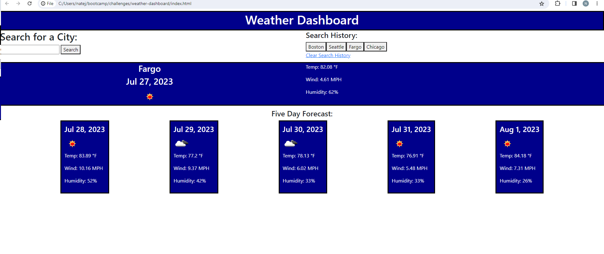

# weather-dashboard
Challenge Description: Developers were tasked with coding an application that took user input and used it to call a third-party API, openweathermap, and use the data fetched from the API call to render specific weather data (the location name, date, temperature, wind speed, humidity, and an icon that represent's the location's weather) for both the current date as well as a five day forecast in the same area. Additionally, developers were tasked with storing any previous searches in search history to ensure that users could recall previous searches quickly and easily.

Skills Displayed: The most important skill displayed in this project is the ability to fetch data from a third-party API. This particular application utilizes three different API calls:

    1. A reverse geocoding API call that takes the searched location name and converts it into latitude and longitude coordinates
    2. A current weather data API that takes the latitude and longitude data and provides current weather data
    3. A weather forecast API that takes the latitude and longitude data and provides forecast data for every 3 hour increment for the next 5 days.

Once this developer was able to successfully call this data, the second skill utilized was to take large quantities of JSON data fetched from the API and convert it into useful data to be rendered to the User Interface upon the search. This required the developer to craft algorithms that populated existing HTML fields with new data as well as rendered entirely new HTML using the aforementioned data.

Finally, the app's acceptance criteria also required that the developer utilize user-side storage (like localStorage) to save previous searches in a manner that could recall and repopulate previously accessed data relatively quickly. The developer utilized a combination of localStorage and JS rendering to create the requested functionality.

Link to deployed application: 

